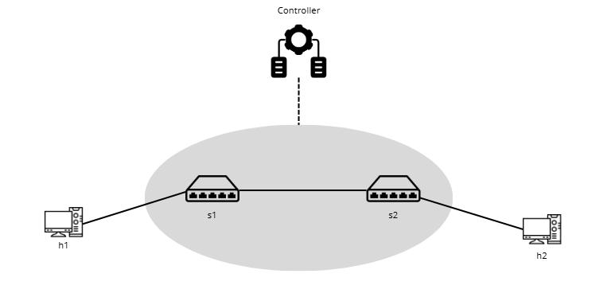
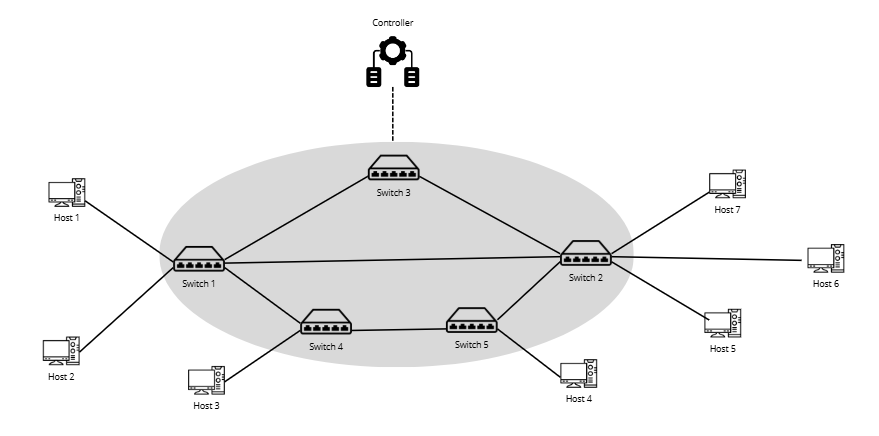

# Topologie sieci

### topologia1.png  
  
Prosta topologia testowa – używana do podstawowych prób implementacji i testów.

### topologia2.png  
  
Główna topologia projektu – wykorzystywana w dalszych etapach.
