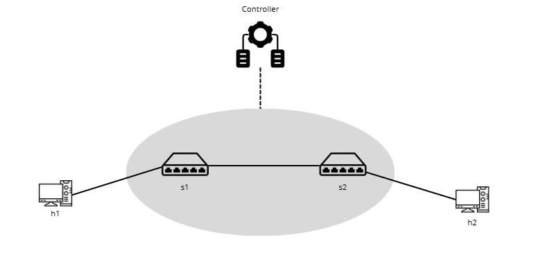
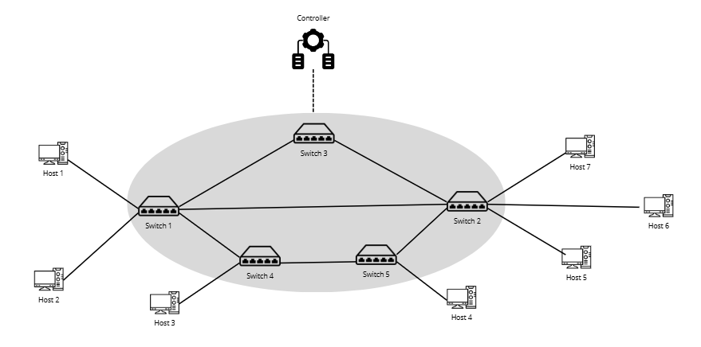
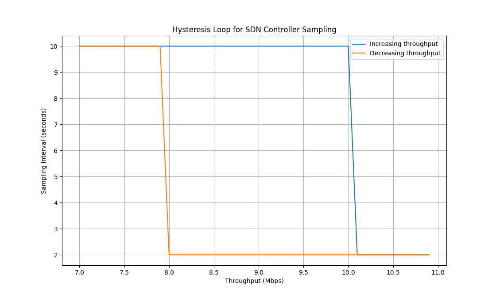

# Instrukcja uruchomienia projektu

## 1. Uruchomienie z Ryu (Zalecane / Pełna symulacja)
monitoring (`controller.py`) oraz serwery iperf na hostach (`run.py`).

Wymagane dwa terminale:

**Terminal 1 (Kontroler):**
```bash
ryu-manager /mnt/mininet-shared/controller.py
```

**Terminal 2 (Topologia i Serwery):**
```bash
sudo python3 /mnt/mininet-shared/run.py
```

---

## 2. Uruchomienie bez Ryu (Tylko test topologii)

```bash
sudo mn --custom /mnt/mininet-shared/Topologia2.py --topo topologia2
```

---

## 3. Generator ruchu

W CLI Mininet (po uruchomieniu `run.py`):
```bash
mininet> h1 /mnt/mininet-shared/traffic_gen.sh
```

Lub podgląd w nowym oknie (xterm):
```bash
mininet> xterm h1

./mnt/mininet-shared/traffic_gen.sh
```

---

## Czyszczenie środowiska
Jeśli po zamknięciu wyskakują błędy "Address already in use":
```bash
sudo mn -c
sudo killall iperf
```

# Topologie sieci

### topologia1.png  
  
Prosta topologia testowa – używana do podstawowych prób implementacji i testów.

### topologia2.png  
  
Główna topologia projektu – wykorzystywana w dalszych etapach.

### histereza.png  
  
Histeraza natężenia ruchu i prędkości próbkowania
